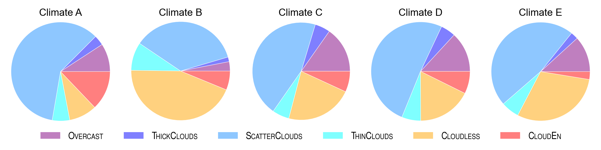

# CAELUS: Classification Algorithm for the Evaluation of the cLoUdiness Situations

[](https://doi.org/10.5281/zenodo.7897639)

<p align="center">
    
</p>

A Python implementation of the CAELUS sky classification algorithm, described in:

> Ruiz-Arias, J. A., and Gueymard, C. A. (2023) CAELUS: classification of sky conditions from 1-min time series of global solar irradiance using variability indices and dynamic thresholds. _Solar Energy_, 263, 111895 doi: [10.1016/j.solener.2023.111895](https://doi.org/10.1016/j.solener.2023.111895) (open access)

CAELUS classifies the sky conditions in up to 6 different classes:

- OVERCAST
- THICK CLOUDS
- SCATTER CLOUDS
- THIN CLOUDS
- CLOUDLESS
- CLOUD ENHANCEMENT

using for that 1-min time series of: solar position, global horizontal irradiance and global horizontal irradiances under hypothetical cloudless and cloudless-and-clean-and-dry atmospheres. It works for solar zenith angles up to 85$`^{\circ}`$.

The package also provides easy access to the [data set](https://doi.org/10.5281/zenodo.7897639) that was used to develop, validate and benchmark the algorithm.

> [!IMPORTANT]
> The name of the different sky conditions is only orientative of the expected situations within each class. However, it does not mean that, for instance, all situations detected as `THICK_CLOUDS` are actually made up only by thick clouds. Among other reasons, because what can be considered a "thick" cloud is highly subjective, and also because there are many situations made up by those "thick" clouds, but also others.

#### Installation

```python
python3 -m pip install git+https://github.com/jararias/caelus
```

#### Classifying data

The classification process is simple:

```python
import caelus
sky_type = caelus.classify(data)
````

where `data` is a Pandas [DataFrame](https://pandas.pydata.org/docs/reference/api/pandas.DataFrame.html) with the following 1-min time-series variables (columns):

- `longitude`: the site's longitude, in degrees
- `sza`: the solar zenith angle, in degrees
- `eth`: the extraterrestrial solar irradiance, in W/m$`^2`$
- `ghi`: the global horizontal irradiance, in W/m$`^2`$
- `ghics`: the clear-sky global horizontal irradiacne, in W/m$`^2`$
- `ghicda`: the cloudless-and-clean-and-dry-sky global horizontal irradiance, in W/m$`^2`$

The dataframe's index must be a Pandas DatetimeIndex in coordinated universal time (UTC).

> [!IMPORTANT]
> It is important to keep data gaps to a minimum as the sky-type classification algorithm relies heavily on variability indicators that are computed as a centered moving window. Data gaps prevent a proper evaluation of such indicators and the classification performance can be deteriorated.

> [!NOTE]
> While an internal approach to evaluate `ghicda` is devised, it will have to be provided externally. This can be done using a clear-sky model with null aerosols and water vapor. It can be the same clear-sky model used to evaluate `ghics` (e.g., [SPARTA](https://github.com/jararias/pysparta)).

> [!NOTE]
> Logging in `caelus` is managed with [loguru](https://loguru.readthedocs.io/en/stable/). If you want to show logging messages, just do:
>
> ```python
> from loguru import logger
> logger.enable('caelus')
> ```

The output is an integer Pandas Series with the same index as the input. In particular, `caelus` identifies the different sky classes with labels from 2 thru 7 (1 is reserved for _UNKNOWN_ situations; e.g., `sza > 85deg`). The correspondence between the integer labels and the actual sky conditions are mapped in the SkyType enumerate type, as you could see by running the following code snippet:

```python
for n in range(1, 8):
    print(n, caelus.skytype.SkyType(n))
```

#### Load data

In order to evaluate the algorithm, `caelus` can also access the individual site-and-year data files used to develop it, and that are available in [zenodo.org](https://doi.org/10.5281/zenodo.7897639). For instance, to load the data taken during 2014 in the BSRN station in Carpentras, France, one can do the following:

```python
import caelus

# `car` is the BSRN's acronymn for the Carpentras station.
# You can explore all the available sites and years, directly
# in the data repository, or in the paper
data = caelus.data.load('car', year=2014)
```

In this case, `data` is a DataFrame with the exactly the same variables enumerated above plus `sky_type`, which is the classification performed by `caelus` for each data instance. For instance, the first 5 data rows with `sza < 85deg` and no `NaN`'s are:

| times_utc           |   longitude |     sza |    eth |   ghi |   dif |   ghics |   ghicda |   sky_type |
|:--------------------|------------:|--------:|-------:|------:|------:|--------:|---------:|-----------:|
| 2014-01-01 08:00:30 |       5.059 | 84.2043 | 142.14 |    94 |    54 |   62.37 |   100.96 |          4 |
| 2014-01-01 08:01:30 |       5.059 | 84.0672 | 145.49 |    97 |    54 |   64.36 |   103.65 |          4 |
| 2014-01-01 08:02:30 |       5.059 | 83.9305 | 148.83 |    99 |    55 |   66.37 |   106.33 |          4 |
| 2014-01-01 08:03:30 |       5.059 | 83.7942 | 152.16 |   102 |    56 |   68.38 |   109.02 |          4 |
| 2014-01-01 08:04:30 |       5.059 | 83.6583 | 155.48 |   104 |    56 |   70.41 |   111.71 |          4 |

> [!NOTE]
> Although `dif` is in the dataframe, it is not used by `caelus`.

When data for a site and year is accessed for the first time, it will take a while because it is first downloaded to a local database. The local database is, by default, `<HOME>/CAELUS-DATA`, where `<HOME>` is the user's directory. However, the user may choose a different location by setting the environment variable `CAELUS_DATA_DIR` to the desired location. Once downloaded, the data will be available in the file `<site_name>/<site_name>_bsrn_<year>.zip` (e.g., `car/car_bsrn_2014.zip`) relative to the local database. Subsequent data requests that involve this file will be faster because the file is already downloaded.

#### Comparing results

One would expect that the `sky_type` column included in the `data` DataFrame is identical to the `sky_type` Series just obtained with `caelus.classify`. However, there are few points with slightly different sky types, that mostly occur at sunrise and sunset, as you would see by running:

```python
print(data.loc[data.sky_type != sky_type])
```

that yields:

| times_utc           |   longitude |     sza |    eth |   ghi |   dif |   ghics |   ghicda |   sky_type |
|:--------------------|------------:|--------:|-------:|------:|------:|--------:|---------:|-----------:|
| 2014-05-27 04:40:30 |       5.059 | 84.8696 | 118.56 |    28 |    28 |   46.31 |    82.53 |          4 |
| 2014-05-27 04:41:30 |       5.059 | 84.7065 | 122.32 |    28 |    28 |   48.37 |    85.48 |          4 |
| 2014-05-27 04:42:30 |       5.059 | 84.5431 | 126.08 |    28 |    28 |   50.45 |    88.44 |          4 |
| 2014-05-27 04:43:30 |       5.059 | 84.3796 | 129.85 |    28 |    27 |   52.57 |    91.42 |          4 |
| 2014-05-27 04:44:30 |       5.059 | 84.2158 | 133.62 |    29 |    28 |   54.71 |    94.42 |          4 |
| 2014-05-27 04:45:30 |       5.059 | 84.0518 | 137.39 |    35 |    29 |   56.88 |    97.44 |          4 |
| 2014-05-27 04:46:30 |       5.059 | 83.8875 | 141.17 |    50 |    30 |   59.08 |   100.47 |          4 |
| 2014-05-27 04:47:30 |       5.059 | 83.7231 | 144.96 |    69 |    31 |   61.3  |   103.52 |          4 |
| 2014-05-27 04:48:30 |       5.059 | 83.5585 | 148.74 |    81 |    31 |   63.55 |   106.59 |          4 |
| 2014-05-29 04:47:30 |       5.059 | 83.5347 | 149.19 |    83 |    36 |   69.17 |   106.98 |          4 |
| 2014-12-18 08:01:30 |       5.059 | 83.4353 | 160.7  |    31 |    26 |   77.49 |   116.11 |          2 |

The reason of this mismatch is that the precision of the data was slightly decreased to reduce the volume of data in the repository, but this was done after the `sky_type` column in `data` was calculated. The precision decrease, however, still keeps reasonable precision level. For instance, GHI and DIF are archived with two significant digits. Nonetheless, it was sufficient to induce the very few discrepancies shown above, even though the two of `sky_type` versions were obtained with this same code. However, note that, in reality, the mismatch is negligible because it affects only to 11 time steps out of the 229,783 time steps that have `sza < 85deg` and no `NaN`'s (i.e., only 0.005%).

#### Diagnostic plots

`caelus` also provides basic functions to make some diagnostic plots:

```python
caelus.diagnostics.histogram(sky_type)
caelus.diagnostics.pie_chart(sky_type)
caelus.diagnostics.density_ktk(data, sky_type)
```
